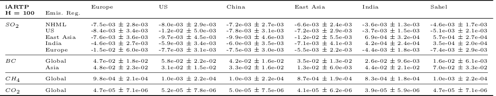
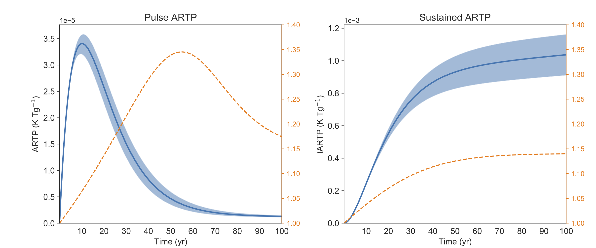

# Regional Emission Metrics (REM)

## About

This repository contains modules that allow to compute climate regional responses to the regional emissions of different pollutants based on global climate model simulations.  

The following responses can be calculated:

* Pulse Absolute Regional Temperature Potential (ARTP)
* Integrated Absolute Regional Temperature Potential (iARTP)
* Pulse Absolute Regional Precipitation Potential (ARPP)
* Integrated Absolute Regional Precipitation Potential (iARPP)
* Regional temperature variation
* Regional precipitation variation

The following pollutants are supported:

* SO<sub>2</sub>
* BC
* CH<sub>4</sub>
* CO<sub>2</sub>

## Setup instructions

### Setting-up the python environment

After cloning the repository:

```bash
git clone https://github.com/carlocorsa/rem.git
```

you need to create a python environment with all required packages. 
Please note the automated installation has been tested using `conda` on OS X and Ubuntu 18.04.

#### Using conda

Create the environment `rem` and install all the required packages by running the command:

```
bash install_conda_env.sh
```

#### Using pip

Install all packages needed using the `requirements.txt` file:

```
pip install -r requirements.txt
```

or (try to) reproduce the development environment by using the `requirements_with_version.txt` file:

```
pip install -r requirements_with_version.txt
```

### Data encryption

The data included in this repository has been encrypted with [transcrypt](https://github.com/elasticdog/transcrypt), a script to configure transparent encryption of sensitive files stored in a Git repository.
In order to use the data, transcrypt needs to be installed in your machine:

```bash
git clone https://github.com/elasticdog/transcrypt.git
cd transcrypt/
sudo ln -s ${PWD}/transcrypt /usr/local/bin/transcrypt
```

For more details see the [installation document](https://github.com/elasticdog/transcrypt/blob/master/INSTALL.md).

To initialise the cloned repository and have access to the encrypted data files, use the command (within the repository):

```bash
transcrypt -c aes-256-cbc -p 'password'
```

where `password` is the password used to encrypt the repository. Please send an email to carlo.corsaro@gmail.com to get the password.

## Modules description

The repository consists of many modules grouped within different packages:

* [simulations](simulations): this package contains modules to select input values for the response calculations, load and calculate variables from stored simulation files, define regions and apply scaling based on PDRMIP multi-model means.

* [metrics](metrics): this package contains modules to compute regional metrics for the different pollutants.

* [scenarios](scenarios): this package contains modules to compute temperature responses to different emission scenarios.

* [plotting](plotting): this package contains modules for plotting responses.

* [uncertainties](uncertainties): this package contains modules to compute and propagate uncertainties.

* [utils](utils): this package contains utility modules (e.g., with statistical functions).

## Examples

Usage examples can be found in the following scripts:

* [so2_bc_bar_plots.py](so2_bc_bar_plots.py): computes and plots all regional temperature and precipitation potentials for emissions of SO<sub>2</sub> and BC from all emission regions.


* [ch4_co2_bar_plots.py](ch4_co2_bar_plots.py): computes and plots all regional temperature and precipitation potentials for emissions of CH4<sub>4</sub> and CO<sub>2</sub>.


* [so2_co2_mixed_temp_scenario.py](so2_co2_mixed_temp_scenario.py): computes and plots the temperature variation due to mixed emission scenarios of SO<sub>2</sub> and CO<sub>2</sub>.


* [potential_tables.py](potential_tables.py): computes temperature and precipitation potentials for all pollutants at different time horizons (defaults are `H = 20` and `H = 100`) and creates `LaTeX` tables that can subsequently edited, if necessary, and transformed into `PDF` or `PNG` files.




* [so2_scaling_impact.py](so2_scaling_impact.py): computes and plots potentials with and without the scalings used for the effective radiative forcing and the climate sensitivity.


* [lifetime_range.py](lifetime_range.py): computes and plots potentials with lower and upper limits that originate from replacing the pollutant lifetime with the lifetime plus or minus one lifetime standard deviation.



## Regions

The following emission regions can be used for SO<sub>2</sub>:

* Northern Hemisphere Mid Latitudes
* United States
* Europe
* East Asia
* India

For BC, the emission regions are:

* Global
* Asia

The following response regions are currently defined:

* Global
* Tropics
* NHML
* NHHL
* SHML
* SHHL
* Europe
* US
* China
* East Asia
* India
* Sahel

New response regions can be easily defined in the module [regions.py](simulations/regions.py).
